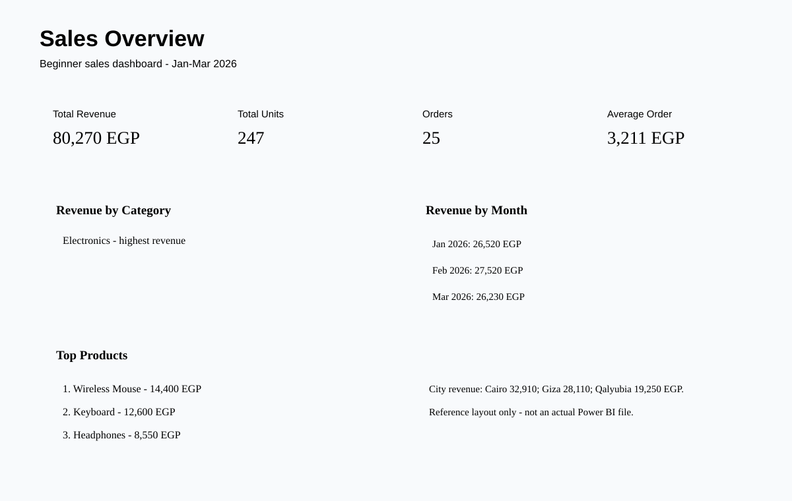

# Sales Analysis - Beginner Portfolio Project

Beginner-level practice project for learning sales analysis with SQL, Python/Pandas and Power BI.

## Dataset
25 practice sales records covering January to March 2026.

This is a learning dataset, not real company data.

## Basic results
- Total revenue: 80,270 EGP
- Total units: 247
- Orders: 25
- Average order value: 3,211 EGP (rounded from 3,210.80 EGP)
- Highest-revenue category: Electronics
- Highest-revenue product: Wireless Mouse

## Monthly revenue
- January 2026: 26,520 EGP
- February 2026: 27,520 EGP
- March 2026: 26,230 EGP

## What I practiced
- Loading and checking data
- Data-integrity checks
- Basic KPIs
- Grouping and aggregation
- Comparing categories, cities, products and months
- SQL
- Python/Pandas
- Preparing a Power BI dashboard

## Dashboard preview

> Reference layout only — not an actual Power BI file.

## Files
- sales_data.csv
- analysis.py
- analysis.sql
- POWER_BI_GUIDE.md
- POWER_BI_DESIGN.md
- sales_dashboard_reference.svg
- NOTES.md